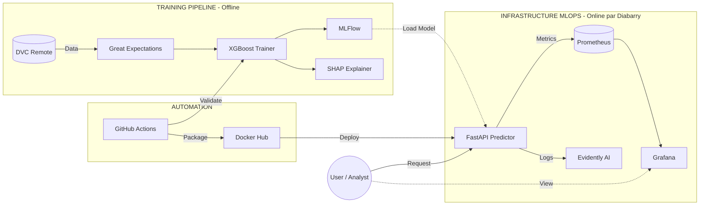
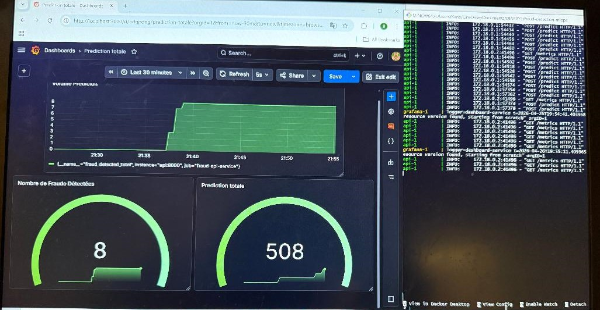
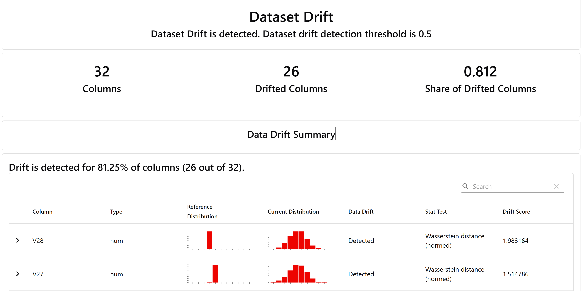
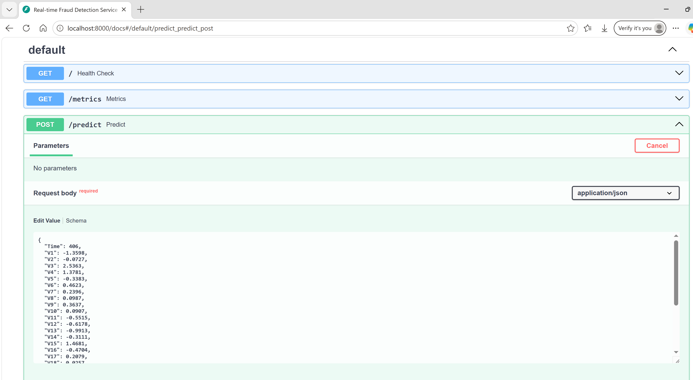

# End-to-End Fraud Detection MLOps Platform
This project is a production-ready Fraud Detection System leveraging modern MLOps practices. It covers the entire lifecycle: from versioned data ingestion and automated training to containerized deployment and real-time monitoring.

## Architecture Overview
The system is built on a modular architecture to ensure scalability and maintainability.


## Visual Preview

### Real-time Monitoring (Grafana)
The Grafana dashboard visualizes system health, prediction latency, and fraud detection rates by scraping metrics from the Prometheus endpoint.




---

### Model Health & Drift (Evidently AI)
We use Evidently AI to detect Data Drift. This report compares the training data distribution with real-world production data to ensure the model remains reliable.


**

---

###  API Documentation (Swagger/OpenAPI)
Our FastAPI service automatically generates interactive documentation. You can test the fraud detection endpoints directly from your browser.


**

##  Tech Stack & Key Features

#### Core ML: XGBoost for high-performance classification with SMOTE/Scale_pos_weight for class imbalance.

#### Data Governance: DVC for data versioning and Great Expectations for automated data quality unit tests.

#### Experiment Tracking: MLflow to log parameters, metrics, and model artifacts.

#### Inference: FastAPI containerized with Docker, providing high-throughput predictions.

#### Observability: Prometheus for technical metrics and Grafana for real-time visualization.

#### Model Health: Evidently AI for Data Drift and Model Drift detection.

#### Explainability (XAI): SHAP to provide global and local interpretability (No "Black Box" models).

#### CI/CD: GitHub Actions for automated linting, testing, and Docker image builds.

## Getting Started

Prerequisites

Docker & Docker Compose

Python 3.10+

DVC (configured with your remote storage)

## 📦 Model & Data Versioning (DVC)

This project uses **DVC (Data Version Control)** to manage large files (models and datasets) without bloating the Git repository.

> **Important:** The `models/model.pkl` and `models/scaler.pkl` files are not stored on GitHub. You must pull them from the remote storage before running the application.

### How to retrieve the models:
 **Ensure DVC is installed**: `pip install dvc`

*"If you don't have access to the DVC remote, you can train the model locally using `python train.py` to regenerate the pickle files."*  
###  Installation & Execution

#### 1. Clone the Repository 
```bash  
git clone https://github.com/your-repo/fraud-detection-mlops.git
```
```bash
cd fraud-detection-mlops 
```
#### 2. Set Up the Environment
You can set up the project manually or use the provided Makefile for a quicker setup.
Manual:

```bash
python -m venv venv
source venv/bin/activate  # On Windows: venv\Scripts\activate
pip install -r requirements.txt
```
Using Makefile:

```bash
make setup
```
#### 3. Data Ingestion & Validation
We use DVC to manage large datasets. Pull the data from the remote storage:

```bash
dvc pull
```
Note: If DVC is not configured, a sample dataset is already provided in the data/ folder.

#### 4.  Run the MLOps Pipeline
This script triggers data validation (Great Expectations), model training (XGBoost), experiment tracking (MLflow), and explainability (SHAP).

Manual:

```bash
python main.py
```

Using Makefile:

```bash
make run
```
Artifacts (models and scalers) will be saved in the models/ directory.

#### 5.  Serving the Model (API)
Start the FastAPI server locally for development:

```bash
uvicorn app:app --reload
```

#### 6.  Deployment with Docker & Monitoring
The project is fully containerized. We use Docker Compose to launch the API alongside the monitoring stack (Prometheus & Grafana).

Build and Start everything:

```bash
docker-compose up --build
```


Or just run the full pipeline (Training to Deployment)
```bash
make all
```


The API & Swagger will be available at http://localhost:8000/docs

Prometheus will be at http://localhost:9090

Grafana will be at http://localhost:3000

#### 7. Model Monitoring & Drift Analysis
To check for Data Drift or Model Performance degradation, you can generate the Evidently AI report:

Open and run the monitor.ipynb notebook.

View the generated HTML report in the monitoring/.

## Monitoring & Quality
### Data Validation
Before training, Great Expectations ensures that:

The Amount column has no null values.

PCA features (V1-V28) stay within expected statistical ranges.

### Drift Detection
We generate an HTML report using Evidently AI to compare the Training (Reference) data vs. Production (Current) data, ensuring the model remains accurate over time.

### Model Interpretability
Check monitoring/ to see why the model flags specific transactions. We use SHAP waterfall plots to show the contribution of each feature to the fraud score.

## Testing
The CI pipeline automatically runs:

```bash
pytest tests/
flake8 ./
```
## Key Contributions in this Project
Robustness: Implemented a "Circuit Breaker" logic for data validation.

Transparency: Added a full XAI (Explainable AI) layer.

Automation: 100% containerized environment with automated CI/CD.


